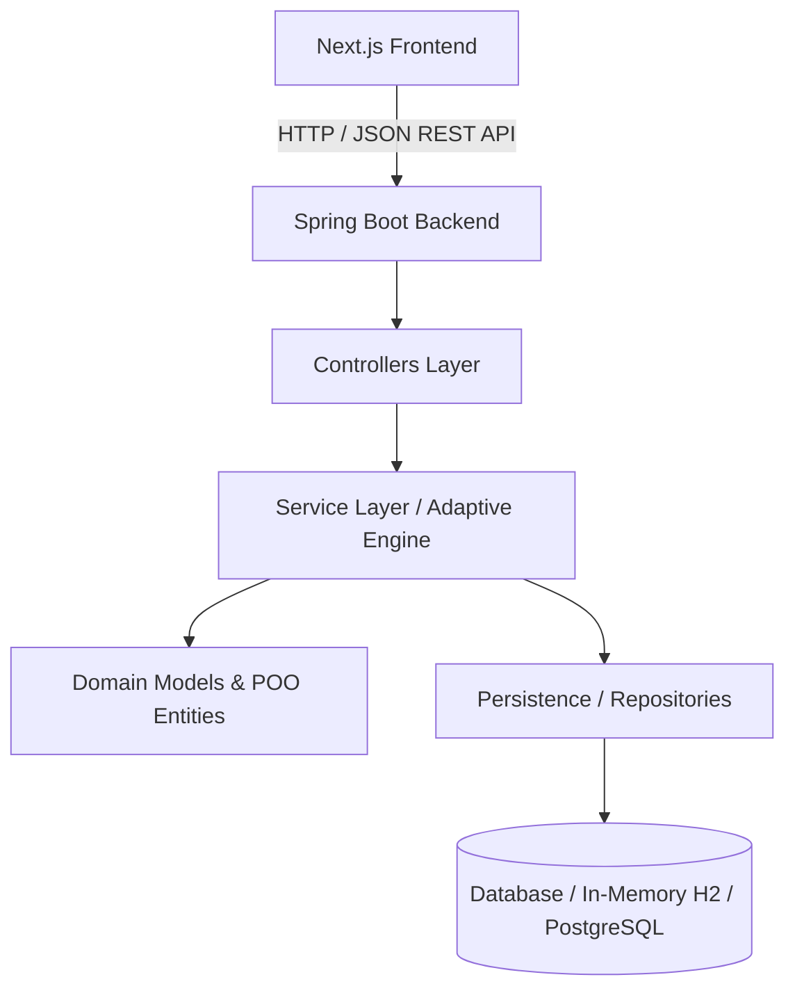

# 📚 Sistema de Leitura Adaptativa POO

<p align="center">
  
  
  
  
  
</p>

Plataforma inteligente de **leitura adaptativa** desenvolvida com foco em conceitos avançados de **Programação Orientada a Objetos (POO)**, arquitetura em camadas com **Spring Boot** no backend e interface moderna e responsiva em **Next.js**.

---

## 🎯 Sobre o Projeto

O **Sistema de Leitura Adaptativa** ajusta dinamicamente a complexidade dos textos e exercícios conforme o desempenho individual de cada leitor. O sistema avalia métricas de compreensão, velocidade e precisão para calibrar o conteúdo apresentado, proporcionando uma curva de aprendizado personalizada.

### 💡 Principais Destaques de POO e Engenharia
- **Modelagem de Domínio Rica**: Aplicação rigorosa dos pilares de POO (Encapsulamento, Herança, Polimorfismo e Abstração).
- **Design Patterns**: Implementação de padrões como *Strategy* (para algoritmos de adaptação de dificuldade) e *Repository* (para persistência desacoplada).
- **Arquitetura Full Stack Desacoplada**: Backend RESTful com Spring Boot e Frontend desacoplado em Next.js com Tailwind CSS.
- **Containerização Completa**: Suporte a execução unificada via Docker Compose.

---

## 🏗️ Arquitetura do Sistema



---

## 🚀 Como Executar o Projeto

### Pré-requisitos
- **Java JDK 21+**
- **Node.js 18+** e **npm**
- **Docker e Docker Compose** (Opcional, para execução containerizada)

### Opção 1: Execução com Docker Compose (Recomendada)

```bash
# Clone o repositório
git clone https://github.com/arthurtvrs10/SistemaDeLeituraAdaptativaPOO.git
cd SistemaDeLeituraAdaptativaPOO

# Suba todos os serviços (Frontend + Backend)
docker-compose up --build
```

Acesse:
- **Frontend**: `http://localhost:3000`
- **Backend API**: `http://localhost:8080`

---

### Opção 2: Execução Manual dos Serviços

#### 1. Backend (Spring Boot)
```bash
cd backend
# No Linux/macOS:
./mvnw spring-boot:run
# No Windows:
./mvnw.cmd spring-boot:run
```
O servidor iniciará em `http://localhost:8080`.

#### 2. Frontend (Next.js)
```bash
cd frontend/my-app
npm install
npm run dev
```
Acesse a aplicação no navegador em `http://localhost:3000`.

---

## 🛠️ Tecnologias Utilizadas

- **Backend**: Java 21, Spring Boot 3, Spring Data JPA, H2 Database / PostgreSQL, Maven.
- **Frontend**: Next.js, React, TypeScript, Tailwind CSS, Lucide Icons.
- **DevOps**: Docker, Dockerfile, Docker Compose.

---

## 📄 Licença

Este projeto está sob a licença [MIT](LICENSE).

---

<p align="center">Desenvolvido por <a href="https://github.com/arthurtvrs10">Arthur Tavares</a></p>
